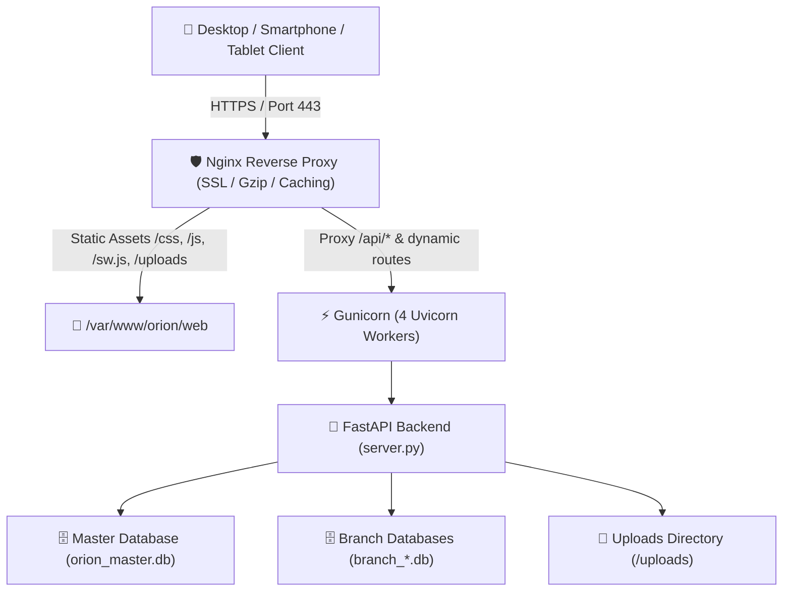

# 🚀 Complete Hostinger Migration & Deployment Guide
## Orion Online School Management System

This guide walks you through migrating the **Orion Online School Management System** from **Vercel** to **Hostinger**.

---

## 📑 Table of Contents
1. [Why Migrate to Hostinger?](#1-why-migrate-to-hostinger)
2. [Deployment Architecture Comparison](#2-deployment-architecture-comparison)
3. [Option 1: Deploy on Hostinger VPS with Docker Compose (Recommended)](#option-1-deploy-on-hostinger-vps-with-docker-compose-recommended)
4. [Option 2: Deploy on Hostinger VPS with Systemd + Nginx + SSL](#option-2-deploy-on-hostinger-vps-with-systemd--nginx--ssl)
5. [Option 3: Deploy on Hostinger Shared / Cloud Hosting (hPanel Python App)](#option-3-deploy-on-hostinger-shared--cloud-hosting-hpanel-python-app)
6. [Data & Database Migration (From Vercel / Local to Hostinger)](#6-data--database-migration-from-vercel--local-to-hostinger)
7. [Domain Name & Free SSL Setup](#7-domain-name--free-ssl-setup)
8. [Automated Daily Backups & Maintenance](#8-automated-daily-backups--maintenance)
9. [Troubleshooting & Verification](#9-troubleshooting--verification)

---

## 1. Why Migrate to Hostinger?

| Feature | Vercel (Serverless) | Hostinger VPS / Cloud |
| :--- | :--- | :--- |
| **Data Persistence** | ❌ Ephemeral (`/tmp` wiped on cold start) | ✅ Permanent disk storage for SQLite & files |
| **Photo & Signature Uploads** | ⚠️ Forced Base64 DB blobs | ✅ Direct disk storage in `/uploads` |
| **Execution Timeouts** | ❌ 10s–60s limit (fails on bulk PDF/ZIP) | ✅ Unlimited execution for heavy batch tasks |
| **Memory & Performance** | ⚠️ Shared serverless limits | ✅ Dedicated RAM, CPU cores & Gunicorn workers |
| **Multi-Tenancy & Databases** | ⚠️ Fragile runtime cloning | ✅ Native multi-tenant schema / multi-DB isolation |
| **PWA & Offline Mode** | ✅ Supported | ✅ Full PWA support + custom caching rules |

---

## 2. Deployment Architecture Comparison



---

## Option 1: Deploy on Hostinger VPS with Docker Compose (Recommended)

Hostinger KVM VPS (KVM 1 / KVM 2 / KVM 4) with Ubuntu 22.04 or 24.04 is the ideal environment.

### Step 1: Connect to your Hostinger VPS
Open your terminal and SSH into your Hostinger server:
```bash
ssh root@YOUR_SERVER_IP
```

### Step 2: Install Docker and Docker Compose
If Docker is not already installed on your Hostinger VPS, run:
```bash
curl -fsSL https://get.docker.com -o get-docker.sh
sh get-docker.sh
apt-get install -y docker-compose-plugin
```

### Step 3: Clone or Upload the Orion Repository
```bash
cd /var/www
git clone https://github.com/your-username/Orion-Online-School-System.git orion
cd /var/www/orion
```

### Step 4: Configure Environment Variables
```bash
cp .env.example .env
nano .env
```
Update the values:
- `APP_URL=https://your-school-domain.com`
- `JWT_SECRET=your-random-32-char-secret`
- `SMS_API_KEY=your_sms_gateway_key` (if using SMS notifications)

### Step 5: Launch the Application
```bash
docker compose up -d --build
```

### Step 6: Verify Deployment
Check that the container is healthy:
```bash
docker ps
curl http://localhost:8000/api/health
```

---

## Option 2: Deploy on Hostinger VPS with Systemd + Nginx + SSL

For maximum bare-metal performance without containers.

### Step 1: Connect to Hostinger VPS & Upload Project
```bash
ssh root@YOUR_SERVER_IP
mkdir -p /var/www/orion
cd /var/www/orion
# Clone from Git or upload project files
git clone https://github.com/your-username/Orion-Online-School-System.git .
```

### Step 2: Run the Automated Deployment Script
We have provided an automated deployment script `deploy.sh`:
```bash
chmod +x deploy.sh
sudo ./deploy.sh
```
This script automatically:
1. Installs Python 3, pip, build dependencies, Nginx, and Certbot.
2. Creates the Python virtual environment (`venv`) and installs all dependencies.
3. Sets up `.env` with a cryptographically secure `JWT_SECRET`.
4. Configures and registers `orion.service` with Systemd.
5. Sets directory permissions for `www-data`.
6. Starts and tests the service.

### Step 3: Configure Nginx
Copy the included `nginx.conf` to Nginx sites directory:
```bash
sudo cp nginx.conf /etc/nginx/sites-available/orion
```
Edit `/etc/nginx/sites-available/orion` to replace `your-school-domain.com` with your actual domain:
```bash
sudo nano /etc/nginx/sites-available/orion
```

Enable the site and reload Nginx:
```bash
sudo ln -sf /etc/nginx/sites-available/orion /etc/nginx/sites-enabled/
sudo nginx -t
sudo systemctl reload nginx
```

### Step 4: Obtain Free SSL Certificate with Let's Encrypt
```bash
sudo certbot --nginx -d your-school-domain.com -d www.your-school-domain.com
```

---

## Option 3: Deploy on Hostinger Shared / Cloud Hosting (hPanel Python App)

If your Hostinger account is a **Cloud Startup**, **Cloud Professional**, or **Shared Web Hosting** plan with hPanel:

### Step 1: Upload Project Files
1. Log in to **Hostinger hPanel**.
2. Go to **Files** -> **File Manager** (or connect via SFTP).
3. Navigate to `/public_html` or create a directory `/orion`.
4. Upload all project files including `passenger_wsgi.py`, `.htaccess`, `server.py`, `config.py`, `web/`, and `database/`.

### Step 2: Setup Python App in hPanel
1. In hPanel, search for **Python** or navigate to **Advanced** -> **Setup Python App**.
2. Click **Create Application**.
3. Configure the settings:
   - **Python version**: `3.11` (or highest available 3.x).
   - **Application root**: `orion` (or `public_html`).
   - **Application URL**: `yourdomain.com` (or subdomain `portal.yourdomain.com`).
   - **Application startup file**: `passenger_wsgi.py`.
   - **Application entry point**: `application`.
4. Click **CREATE**.

### Step 3: Install Dependencies
1. Under the Python App dashboard, enter the virtual environment command shown in hPanel via SSH or terminal:
   ```bash
   source /home/YOUR_USER/virtualenv/orion/3.11/bin/activate && cd /home/YOUR_USER/orion
   pip install -r requirements.txt
   ```
2. Or click **Run pip install** in the hPanel GUI and specify `requirements.txt`.

### Step 4: Upload & Verify `.htaccess`
Ensure the provided `.htaccess` is located in the root web directory (`public_html/.htaccess`).

---

## 6. Data & Database Migration (From Vercel / Local to Hostinger)

To migrate your existing schools, branches, students, fees, and staff data:

### Transferring Database Files
Copy all `.db` files from your local computer / old server to the Hostinger server's data directory:
```bash
# Using SCP to upload local databases to Hostinger VPS:
scp orion_master.db school_management.db branch_*.db root@YOUR_SERVER_IP:/var/www/orion/data/
```

### Transferring Uploaded Student Photos & Signatures
```bash
scp -r web/uploads/* root@YOUR_SERVER_IP:/var/www/orion/web/uploads/
```

### Setting Ownership & Permissions
```bash
# On Hostinger VPS:
sudo chown -R www-data:www-data /var/www/orion/data
sudo chown -R www-data:www-data /var/www/orion/web/uploads
sudo chmod -R 775 /var/www/orion/data
sudo chmod -R 775 /var/www/orion/web/uploads
```

---

## 7. Domain Name & Free SSL Setup

1. **DNS Records**:
   In your Hostinger DNS Zone Editor or Cloudflare:
   - **A Record**: `@` points to your `HOSTINGER_VPS_IP`
   - **A Record**: `www` points to your `HOSTINGER_VPS_IP`
   - **CNAME Record (optional subdomain)**: `portal` points to `@`

2. **Verify Propagation**:
   ```bash
   ping your-school-domain.com
   ```

3. **Install SSL (Certbot)**:
   ```bash
   sudo certbot --nginx -d your-school-domain.com -d www.your-school-domain.com --redirect
   ```

---

## 8. Automated Daily Backups & Maintenance

To create an automatic midnight backup of all databases and media files:

1. Open crontab:
   ```bash
   sudo crontab -e
   ```
2. Add the daily backup job:
   ```cron
   # Backup Orion School databases every night at 02:00 AM
   0 2 * * * tar -czf /var/backups/orion_backup_$(date +\%Y\%m\%d).tar.gz -C /var/www/orion data web/uploads
   # Keep only the last 30 daily backups
   0 3 * * * find /var/backups/ -name "orion_backup_*.tar.gz" -mtime +30 -delete
   ```

---

## 9. Troubleshooting & Verification

### Helpful Commands on Hostinger VPS

| Command | Purpose |
| :--- | :--- |
| `sudo systemctl status orion.service` | Check application service status |
| `sudo journalctl -u orion.service -f` | View live application logs |
| `sudo systemctl restart orion.service` | Restart the backend service |
| `sudo nginx -t && sudo systemctl reload nginx` | Test and reload Nginx |
| `curl http://localhost:8000/api/health` | Test internal backend health API |

### Common Issues & Fixes

1. **502 Bad Gateway**:
   - Check if the backend is running: `sudo systemctl status orion.service`.
   - Check logs: `sudo journalctl -u orion.service -n 50 --no-pager`.
2. **Permission Denied on Database / Uploads**:
   - Run: `sudo chown -R www-data:www-data /var/www/orion/data /var/www/orion/web/uploads`.
3. **PWA Install Banner Not Showing**:
   - Ensure HTTPS is active (Service Workers require HTTPS).
   - Verify `/manifest.json` and `/sw.js` are accessible in browser.
